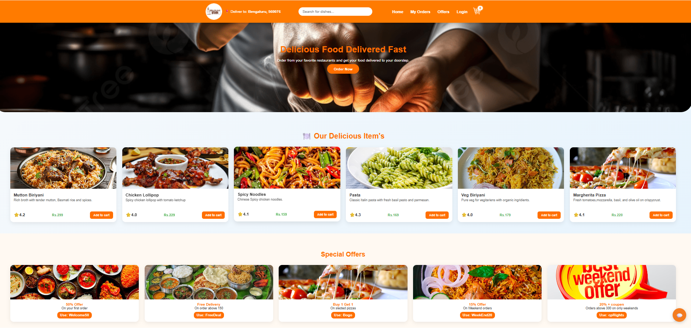
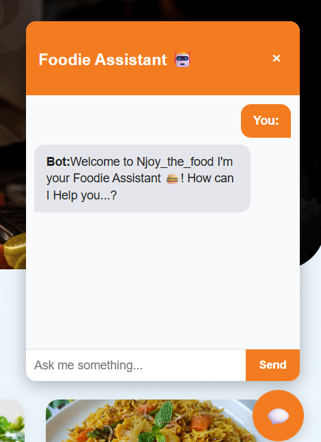
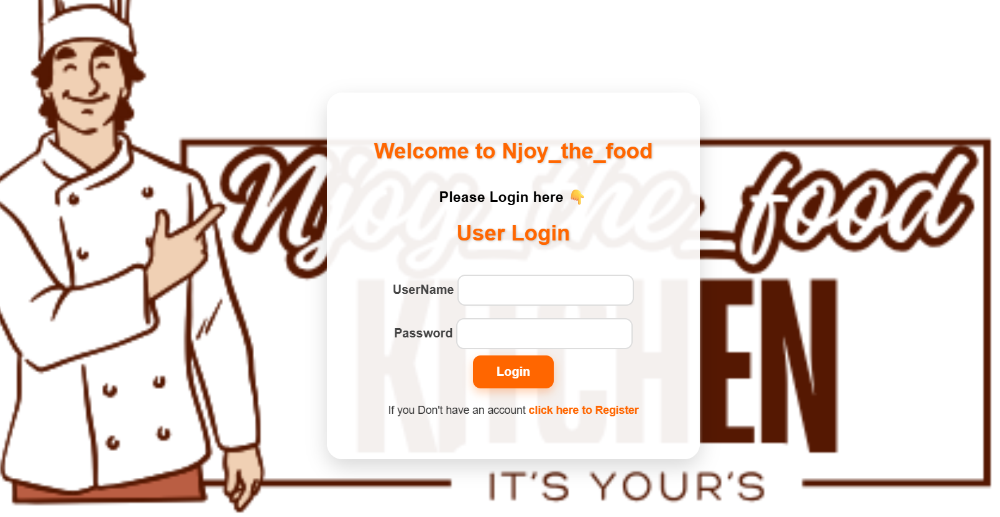
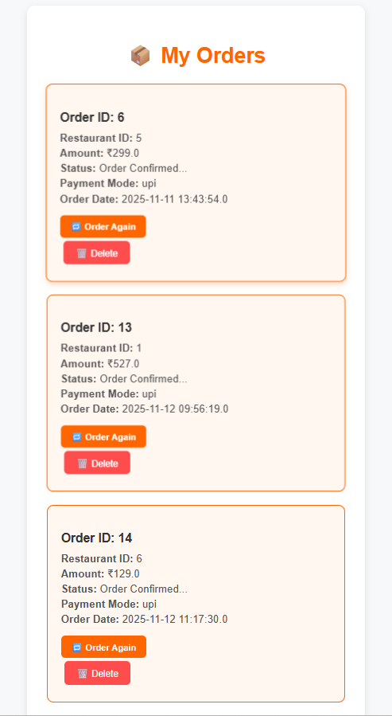
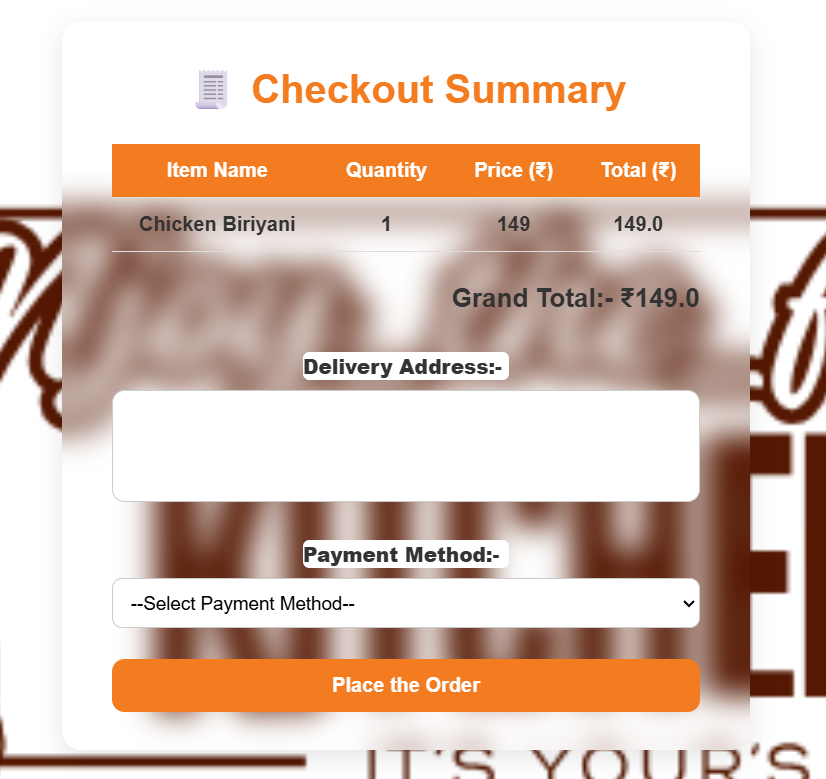
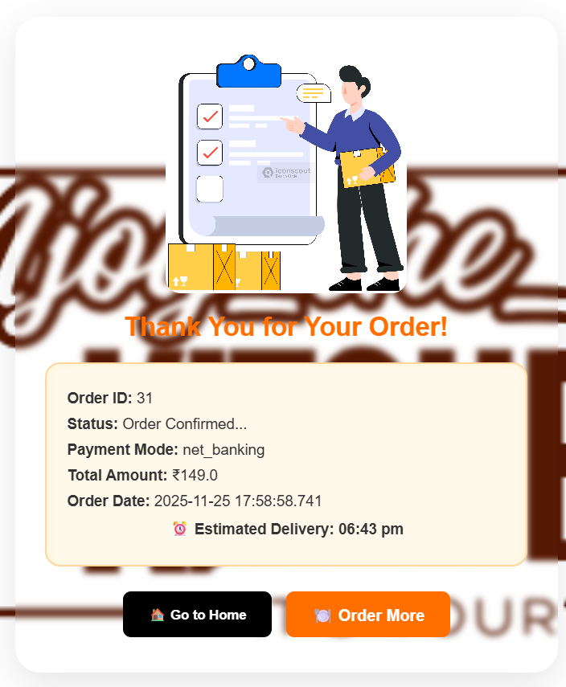

# 🍽️ Njoy_the_food – Online Food Delivery Web Application

## 🎥 Project Demo Video

➡️ 

➡️ [Click here to watch the demo video](project-demo.mp4)

---

## 📌 Project Overview

**Njoy_the_food** is a full-stack Java web application that delivers a complete online food ordering experience.  
Users can browse restaurants, explore menus, add items to cart, place orders, track delivery, and interact with a built-in chatbot assistant — all through a smooth, modern, and responsive UI.

This platform is designed using **Java, JSP, Servlets, JDBC, MySQL, HTML, CSS, and JavaScript**, deployed locally on **Apache Tomcat**.

---

## 📸 Project Screenshots

### 🏠 Home Page  

### 🍽️ Food Menu / Popular Items  

### 🛒 Cart Page  

### 🤖 Foodie Chatbot Assistant  

### 🔐 Login Page  

### 📝 User Registration  

### 📦 My Orders Page  

### 💳 Checkout Summary  

### 🎉 Order Success Page  

### 🛵 Delivery Animation  

---

## 📝 Description

**Njoy_the_food** is an online food delivery web application built to simulate real-world delivery platforms such as Swiggy and Zomato.  
It features dynamic menu rendering, cart management, order tracking, secure authentication, and an interactive chatbot — delivering a delightful user experience from browsing to checkout.

---

## 🛠 Tech Stack

### **Frontend**
- HTML5  
- CSS3  
- JavaScript  

### **Backend**
- Java  
- JSP  
- Servlets  
- JDBC  

### **Database**
- MySQL  

### **Server**
- Apache Tomcat  

### **Tools**
- Eclipse IDE  
- Git & GitHub  

---

## ⭐ Key Features

- ✔ Beautiful, responsive home page with categories  
- ✔ Dynamic restaurant & food menu display  
- ✔ Add to cart / remove / update quantity  
- ✔ Real-time billing calculation  
- ✔ Checkout page with address & payment  
- ✔ Order confirmation with estimated delivery  
- ✔ “My Orders” history with delete option  
- ✔ Login & registration system  
- ✔ Chatbot assistant for help and suggestions  
- ✔ Database-driven backend  
- ✔ Clean and modern UI  

---

## 📂 Project Structure
Njoy_the_food/
├── src/main/java/
│ ├── com.tap.controller/ # Servlets
│ ├── com.tap.dao/ # DAO Classes
│ ├── com.tap.model/ # Java Models
│ └── com.tap.util/ # DB Connection
│
├── src/main/webapp/
│ ├── css/
│ ├── js/
│ ├── images/
│ ├── pages/ # JSP pages
│ ├── index.jsp
│ └── checkout.jsp
│
└── Database/
└── njoy_the_food.sql

## 🚀 How to Run This Project

### 1️⃣ Clone the Repository  
git clone https://github.com/himamteja/Foodie_Application

### 2️⃣ Import into Eclipse  
- Go to **File → Import → Existing Projects into Workspace**  
- Select the cloned folder  

### 3️⃣ Configure Apache Tomcat  
- Add Tomcat Server 9/10 in Eclipse  
- Set project to run on server  

### 4️⃣ Setup MySQL Database  
- Import the SQL file into MySQL  
- Update DB credentials in:  

### 5️⃣ Run the Project  
Right-click project → **Run on Server**

### 6️⃣ Open in Browser  
http://localhost:8080/Food_Application/

---

## 👨‍🍳 Developed By  
**Himamteja**  
Java Developer | Full-Stack Enthusiast | UI/UX Designer  

---

## ⭐ Support  
If you like this project, please ⭐ star the repository — it motivates me to build more!  
