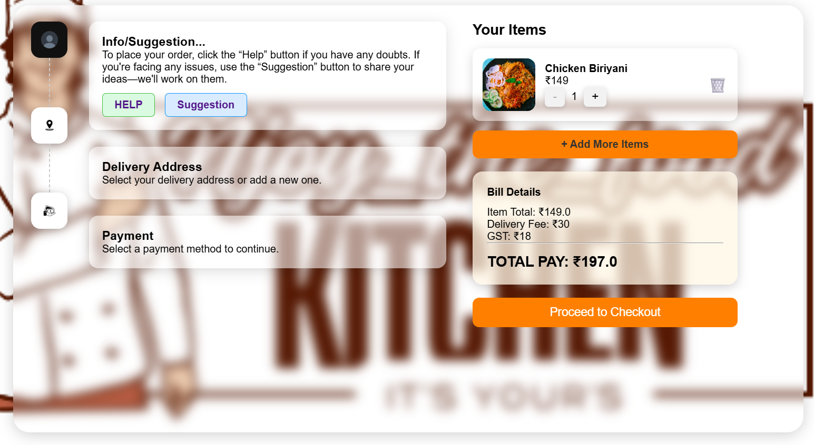
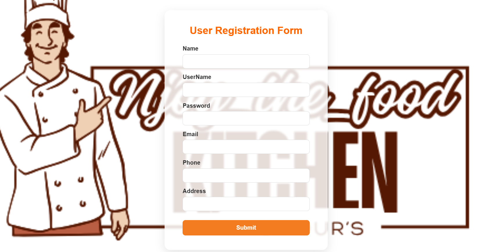
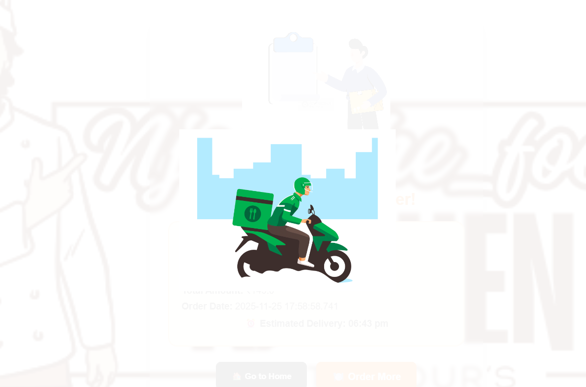

  

<h1 align="center">🍽️ Njoy_the_food – Online Food Delivery Web Application</h1>

  A full-stack Java web application for seamless food ordering, real-time cart updates, order tracking, and chatbot assistance — built using JSP, Servlets & MySQL.

  <a href="#-project-overview">Overview</a> •
  <a href="#-tech-stack--badges">Tech Stack</a> •
  <a href="#-features">Features</a> •
  <a href="#-screenshots">Screenshots</a> •
  <a href="#-getting-started">Getting Started</a> •
  <a href="#-contributing">Contributing</a> •
  <a href="#-license">License</a>

---

## 🎥 Demo Preview (GIF)

  

---

## 🎥 Project Demo Video

➡️ **Watch Full Video:👇**  
[Click here to watch the demo](screenshots/project-demo.mp4)

---

## 🛠 Tech Stack & Badges

  
  
  
  
  
  
  
  
  
  

---

## 📌 Project Overview

**Njoy_the_food** is a full-stack Java web application that simulates a modern online food delivery platform.

Users can:

- Browse restaurants and food items  
- Add items to cart with quantity updates  
- View order summary and checkout  
- Track order confirmations  
- Access their order history  
- Get help using a simple chatbot-style assistant 🤖  

Built with **JSP, Servlets, JDBC, and MySQL**, it focuses on **clean UI, responsiveness, and real-world flow** like popular apps (Swiggy / Zomato).

---

## ✨ Features

- 🏠 **Home page** with highlighted categories & offers  
- 🍲 **Dynamic menu listing** from backend  
- 🛒 **Add to cart**, update quantity, and remove items  
- 📄 **Order summary & checkout flow**  
- ✅ **Order confirmation** page with success message  
- 📦 **My Orders** page to view past orders  
- 🔐 **User authentication** – login & registration  
- 🤖 **Chatbot-like helper** for guidance  
- 🗄 **MySQL database** integration with JDBC  
- 📱 **Responsive design** for desktop & mobile  

---

## 🖼 Screenshots

> All screenshots are resized to keep the README clean and neat.

## 🖼 Screenshots

### Row 1
<table align="center">
  <tr>
    <td align="center">
       
      <b>🏠 Home Page</b>
    </td>
    <td align="center">
       
      <b>🍽️ Menu</b>
    </td>
    <td align="center">
       
      <b>🛒 Cart</b>
    </td>
  </tr>
</table>

---

### Row 2
<table align="center">
  <tr>
    <td align="center">
       
      <b>🤖 Chatbot</b>
    </td>
    <td align="center">
       
      <b>🔐 Login</b>
    </td>
    <td align="center">
       
      <b>📝 Registration</b>
    </td>
  </tr>
</table>

---

### Row 3
<table align="center">
  <tr>
    <td align="center">
       
      <b>📦 My Orders</b>
    </td>
    <td align="center">
       
      <b>💳 Checkout</b>
    </td>
    <td align="center">
       
      <b>🎉 Order Success</b>
    </td>
  </tr>
</table>

---

### Row 4
<table align="center">
  <tr>
    <td align="center">
       
      <b>🛵 Delivery Animation</b>
    </td>
  </tr>
</table>

---

## 🚀 Getting Started (High Level)
1️⃣ Clone the Repository
git clone 👉 https://github.com/himamteja/Foodie_Application.git

2️⃣ Import into Eclipse

Open Eclipse IDE

Go to: File → Import → Existing Projects into Workspace

Select the cloned folder and finish

3️⃣ Configure Apache Tomcat

Add a new Apache Tomcat 9/10 server in Eclipse

Right-click project → Properties → Targeted Runtimes → select Tomcat

4️⃣ Setup MySQL Database

Create a database (e.g. njoy_the_food or your DB name)

Import your SQL schema/data if you have one

Update DB credentials in your DB connection class, for example:

## // Example
String url = "jdbc:mysql://localhost:3306/your_db_name";
String username = "root";
String password = "your_password";

5️⃣ Run the Application

Right-click on the project → Run As → Run on Server

Choose your Tomcat server

---

## Open browser and navigate to:👇

http://localhost:8080/Food_Application/

---

##📜 License (MIT)
---
This project is licensed under the MIT License.

©2025 Himamteja Peyyala

Permission is hereby granted, free of charge, to any person obtaining a copy
of this software and associated documentation files (the "Software"), to deal
in the Software without restriction, including without limitation the rights
to use, copy, modify, merge, publish, distribute, sublicense, and/or sell
copies of the Software, and to permit persons to whom the Software is
furnished to do so, subject to the following conditions:

THE SOFTWARE IS PROVIDED "AS IS", WITHOUT WARRANTY OF ANY KIND, EXPRESS OR
IMPLIED, INCLUDING BUT NOT LIMITED TO THE WARRANTIES OF MERCHANTABILITY,
FITNESS FOR A PARTICULAR PURPOSE AND NONINFRINGEMENT.

---

## 👨‍💻 Author

Himamteja Peyyala
🔗 GitHub: https://github.com/himamteja

---

## 🌐 GitHub: @himamteja

---

## ⭐ Support

If you found this project useful, please consider giving it a ⭐ on GitHub.
It really motivates me to build and share more projects! 😊

---

## 🎉 Thank you for visiting my Project-repo!  

  

